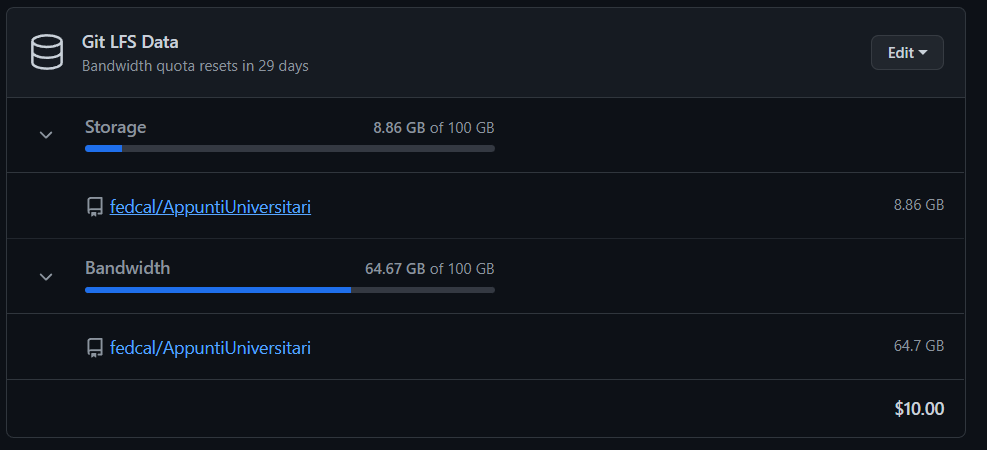

# Degree Notes

This project was born with the intention of sharing university notes relating to university courses in Computer Science, Data Mining and Cyber Security. If you want, it is possible to add also notes edited by workers that work in the sector, please put it on a folder.

I ask all those who want to contribute to clone the project locally and add your notes in an organized way or to link your repositories in this file, I will integrate it.

The goal is to create a single space where you can find all the material possible.

**SPONSOR**
I will active the sponsor for this repo. To cover all the maintenance costs of the GitHub Account and Git LFS that are very usefull and important for the upload of notes and books in the repo. So i am very exited if you want sponsor me to cover this costs. And if you will share the repo to everyone, we can reach the goals as soon as possible. Thanks.

The actual costs of this repo:

If you want to contact me, please visit [my website](https://federicocalo.it).
